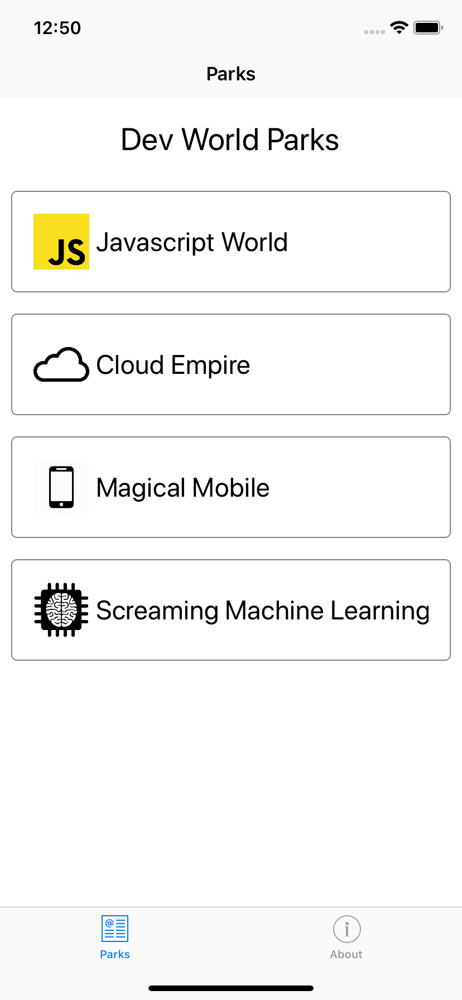
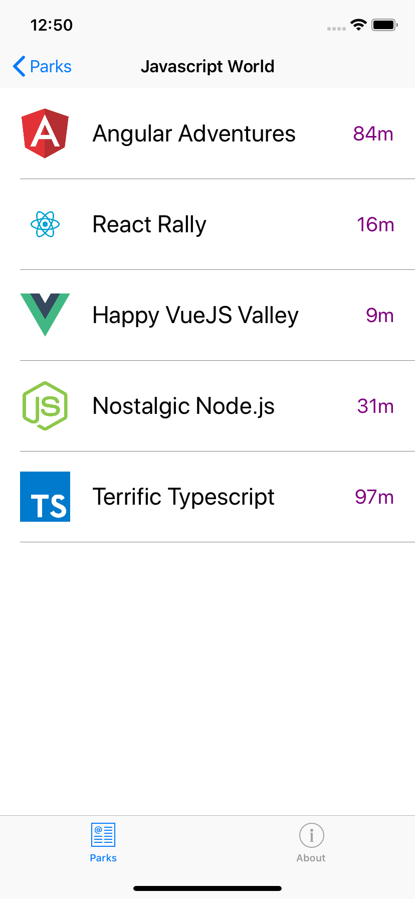
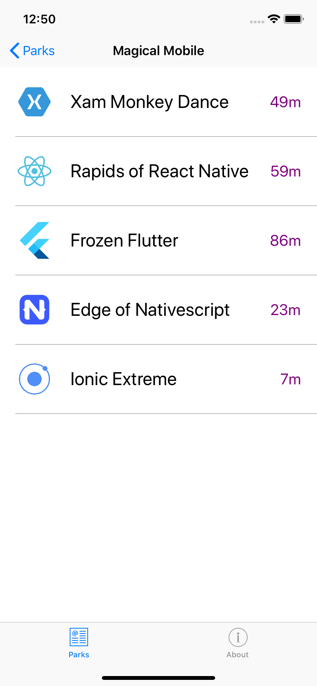

# Build Efficient Xamarin Apps with GraphQL

This repository explains how to develop the GraphQL server using .NET Core and integrate GraphQL Backend in Xamarin apps. This is the demo of the talk "Build Efficient Xamarin apps with GraphQL"

Slides of the talk:
https://slides.com/sivamuthukumar/xamarin-graphql

## Dev Parks Demo

The idea for the demo of this talk is - we are going to build the fictional theme park that has parks and rides based on the technology. (For e.g Javascript World park has Angular Adventures, Happy Vue Valley, etc).

### Parks

    </img>

### Rides

  
    

## Projects

### GraphQL

The backend .NET core server is integrated with GraphQL.NET library.  You can run and hit the GraphQL playground (https://localhost:5001/playground) and play with graphql. 

You've to create the CosmosDB - with Parks & Rides Collection. The sample data is in "Data" directory. You can import into your collection if you want to play with demo.

### DevParks Backend Server

* Update the cosmosdb connection string in appSettings.json 
* Run the backend server
* Navigate to https://localhost:5001/playground to play with GraphQL schema

### DevParks Xamarin App

* Update the graphql backend url to localhost or the domain name you are hosting your backend server.
* Run the application and you can see

### DevParks Wait Time Update

* This project is to demo how the subscription works
* Wait time updater pick random rides and update Wait time
* If you are running the client application, the subscription works and see the client is updated with wait times.

# Future Plans

-[ ] Update the cosmosdb import utility or change into postgresql docker
-[ ] Implement Authentication/Authorization
-[ ] Dataloader
-[ ] More clean data
